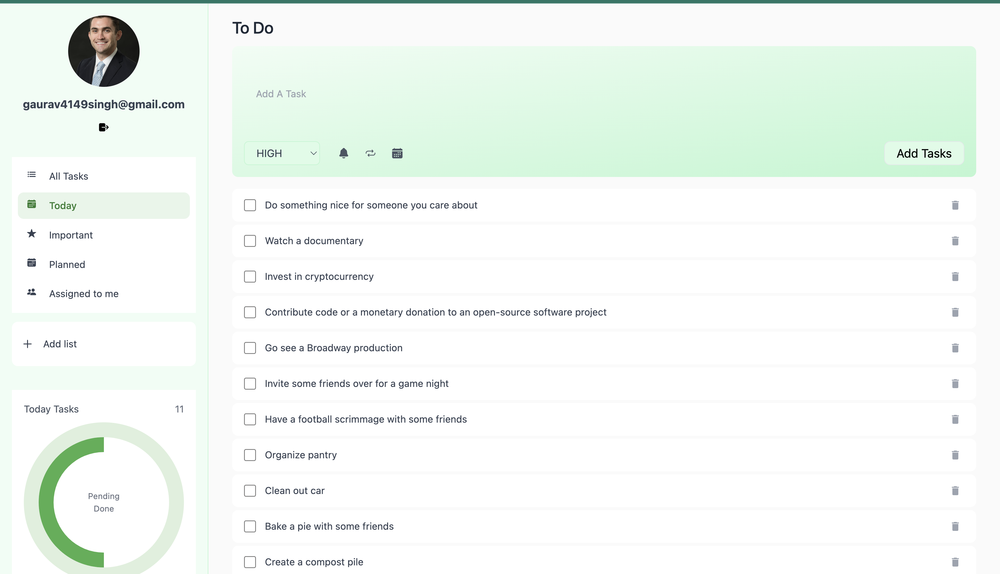
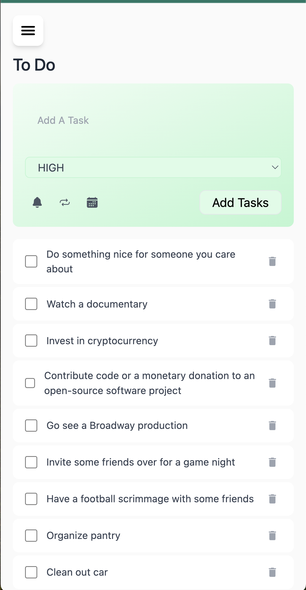
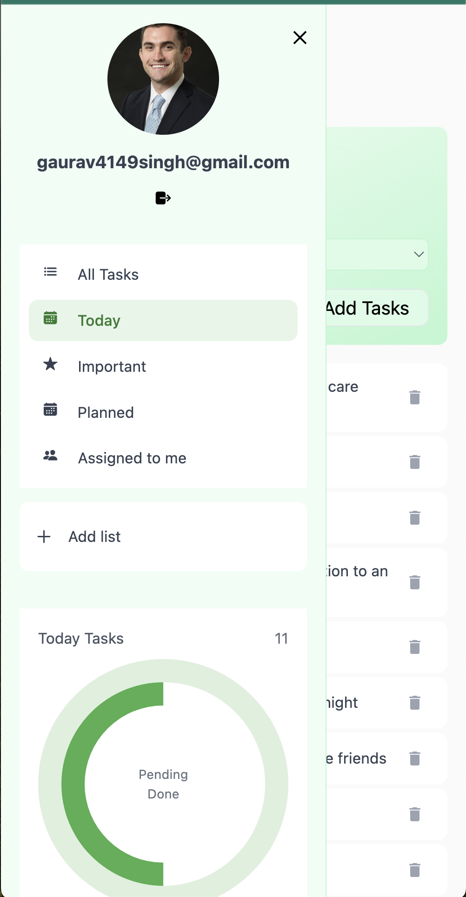

<div align="center">
  <h1>📝 React Redux Todo App</h1>
  <p>A modern todo application with authentication and real-time updates</p>
</div>

## ✨ Key Features

### 🔐 Authentication

- Email validation and secure login
- Local storage persistence
- Protected routes
- Simple logout functionality

### 📋 Todo Management

- Create and manage todos
- Mark tasks as complete/incomplete
- Set priority levels (HIGH/MEDIUM/LOW)
- View completed and pending tasks
- Sidebar for mobile view

### 🎨 UI Features

- Clean, modern interface
- Mobile-responsive design
- Loading states and animations
- Toast notifications

## 🚀 Quick Start

```
npm install
npm run dev
```

## 🔧 Tech Stack

- React + Vite
- Redux + Redux Thunk
- TailwindCSS
- React Router
- Axios
- React Toastify

## 📱 Screenshots

<div align="center">
  
  
  
</div>

## 🤝 Contributing

Pull requests are welcome. For major changes, please open an issue first.

## 📝 License

[MIT](https://choosealicense.com/licenses/mit/)

---

<div align="center">
  Made with ❤️ using React and Redux
</div>
